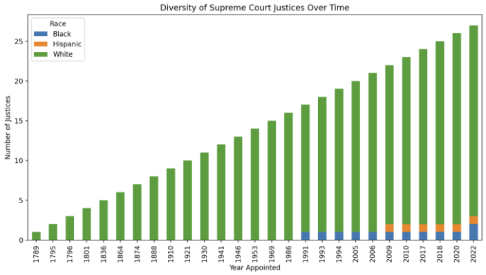
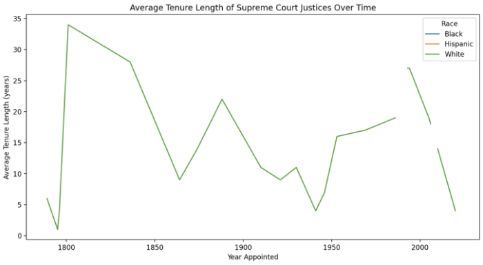
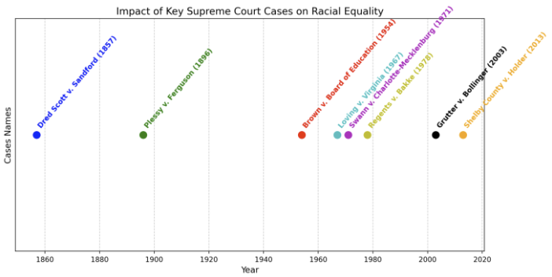

# Supreme Court Justices and Racial Equality Cases Analysis

## Overview
This project provides a data analysis dashboard for visualizing information about U.S. Supreme Court Justices and significant Supreme Court cases impacting racial equality with in America. The dashboard includes several visualizations that help understand the composition and history of the Supreme Court and its influence on racial equality in the United States.

## Files in the Repository
- `app.py`: The main Streamlit application file containing the code for the data analysis dashboard.
- `SupremeCourt.csv`: A CSV file containing data on Supreme Court Justices, including their names, ages, races, years appointed, positions, genders, nominated by, parties, tenures, tenure lengths, and states of origin.
- `RacialEqualitycases.csv`: A CSV file containing data on significant Supreme Court cases impacting racial equality, including case names, decisions, years, Chief Justices, and impacts.

## Visualizations
The dashboard includes the following visualizations:

### How has the diversity of the Supreme Court Justices changed over time?
A stacked bar chart showing the racial composition of Supreme Court Justices over the years.


### What has been the average tenure length of Supreme Court Justices over time, and how does it differ by race?
A line chart showing the average tenure length of Supreme Court Justices over time, differentiated by race.


### What has been the impact of key Supreme Court cases on racial equality?
A timeline chart showing the major Supreme Court cases related to racial equality and their impact.


## Running the Dashboard
To run the dashboard locally:

1. **Install Command Line Tools for Xcode (macOS only)** (if not already installed):
    ```bash
    xcode-select --install
    ```

2. **Navigate to the project directory**:
    ```bash
    cd Supreme-Court
    ```

3. **Install the required Python packages**:
    ```bash
    pip install -r requirements.txt
    ```

4. **Install Watchdog (optional but recommended)**:
    ```bash
    pip install watchdog
    ```

5. **Run the Streamlit app**:
    ```bash
    streamlit run app.py
    ```

6. Open your web browser and go to the URL provided by Streamlit to view the dashboard.

## Deployment
The app can be deployed to Streamlit Cloud for easy sharing and access. Ensure your GitHub repository is public, and follow the deployment steps on Streamlit Cloud.

## License
This project is licensed under the MIT License.