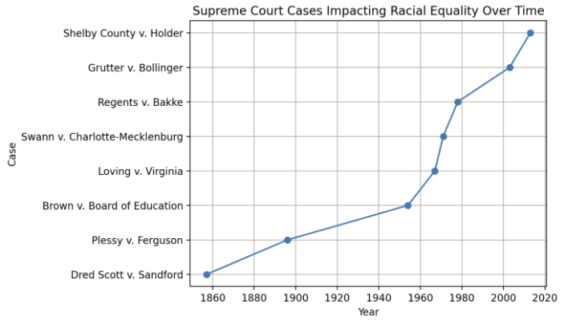

# Supreme Court Justices and Racial Equality Cases Analysis

## Overview
This project provides a data analysis dashboard for visualizing information about U.S. Supreme Court Justices and significant Supreme Court cases impacting racial equality. The dashboard includes several visualizations that help understand the composition and history of the Supreme Court and its influence on racial equality in the United States.

## Files in the Repository
- `app.py`: The main Streamlit application file containing the code for the data analysis dashboard.
- `SupremeCourt.csv`: A CSV file containing data on Supreme Court Justices, including their names, ages, races, years appointed, positions, genders, nominated by, parties, tenures, tenure lengths, and states of origin.
- `RacialEqualitycases.csv`: A CSV file containing data on significant Supreme Court cases impacting racial equality, including case names, decisions, years, Chief Justices, and impacts.

## Visualizations
The dashboard includes the following visualizations:

### Supreme Court Cases Impacting Racial Equality
A bar chart showing significant Supreme Court cases impacting racial equality over the years.


### Cases Over Time
A line chart showing significant Supreme Court cases impacting racial equality over time.


### Justices by Year Appointed and State of Origin
A horizontal bar chart showing Supreme Court Justices by year appointed and state of origin, with colors representing the states.


## Running the Dashboard
To run the dashboard locally:

1. Navigate to the project directory:
    ```bash
    cd Supreme-Court
    ```

2. Install the required Python packages:
    ```bash
    pip install -r requirements.txt
    ```

3. Run the Streamlit app:
    ```bash
    streamlit run app.py
    ```

4. Open your web browser and go to the URL provided by Streamlit to view the dashboard.

## Deployment
The app can be deployed to Streamlit Cloud for easy sharing and access. Ensure your GitHub repository is public, and follow the deployment steps on Streamlit Cloud.

## License
This project is licensed under the MIT License.
